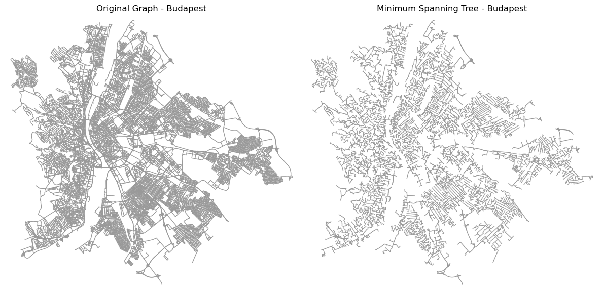

# Network Analysis of Street Networks

In this notebook, I analyzed the street networks of various cities by computing different network indices and visualizing the original graph and the Minimum Spanning Tree (MST). The analysis includes:
- Place/Network area in square kilometers.
- Network length in kilometers.
- Network density (km/km^2).
- Alpha, Beta, and Gamma indices for the graph.
- Length and density of the Minimum Spanning Tree.

I used the `osmnx` library to obtain and process the graphs and `matplotlib` for visualizations.

